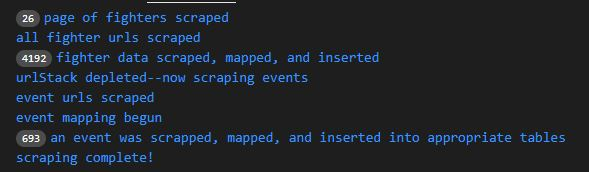

# UFC Scraper

UFC Scraper is a application that inserts UFC stats from [ufcstats.com](http://www.ufcstats.com/) in a SQL database. This application was intended for educational purposes.



## Installation

Use [composer](https://getcomposer.org/) to install Symfony's Brower Kit, CSS Selector, and Http Client from the composer.json file.

```bash
composer update
```

Additionally, you need to have SQLite enabled in PHP's config files. Run the src/db/index.php file to create the database. Alternatively, you could create the SQLite file by other means, but the earlier referred to file has the needed table structures.

```bash
php src/db/index.php
```

## Usage

This application is not intended to be used. However, it was an opportunity to learn about data cleaning, data scraping, object oriented programming, and it was my first non-Laravel PHP project. Additionally, it gave me a chance to practice data structures.

There are three main objects in this program: Scraper, Mapper, SQLiteConnection. For a detailed explantion of the classes please see the below section.

The program first iterates through every webpage that contains fighter's names, which also contain urls that point to their stats, [for example](http://ufcstats.com/statistics/fighters?char=&page=all). It then contains all of these urls in a stack, $urlStack. It also waits one second inbetween every request to ensure their servers are not bothered with the traffic.

Next, it pops a url off the stack until there are none left. The scraper will remove the career stats and the name of the fighter and place them in a temporary dictionary. The mapper will then finalize the cleaning of the data, and place them into a data transfer object that correlates with the fighter sql table. Once that is finished, the SQLiteConnection object, $pdo, will create a connection to the database and insert the data. Next, it will close the connection and repeat the process.

After finishing all of the fighter urls, the scraper with create a new url stack, $urlStack, from [the events page](http://ufcstats.com/statistics/events/completed?page=all). As the name suggests, it is a stack of strings that contain urls that point to each of the UFC event's stats.

Now, our program will pop off the stack until there is one url left. This is due to the format of the website. The first URL in the table element coorelates to an event that hasn't occurred yet, so it won't give us any data that we want.

The Scraper object will then scrape the event stats. This is the first three indices of the dictionary / array returned by Scraper::scrapeEventStats, $eventStats. The Mapper object will then map the data into a DTO to prepare it for insertion, and the SQLiteConnection object, $pdo, will insert it.

Our scraper will then pop entries off of $eventStats until only the three indices holding the event information are remaining. This data refers to each fight within the event's statistics. With each pop, $mapper will place the data from the element into a DTO, and $pdo will insert it into the database. The integer, $currentEvent holds the place of the ID of the event that the fight took place in. This allows the app to avoid doing a database query to find the event ID.

After only one url is left, the app is finished.

## Important Classes

There are three main classes that make up the functionality of this app: Scanner, Mapper, and SQLiteConnection.

### Scanner

Scanner methods have two private properties:

1. __$browser:__
    - An instance of a HttpBrowser.
    - It's a headless browser.

2. __$converter:__
    - An instance of a CssSelectorConverter.
    - It generates XPath expressions from CSS.

I chose to use the CSS converter because I already understand CSS. I could've extracted an XPath expression directly from dev tools on the browser, but this seemed like a better idea to me since I understand it.

The scraping methods follow a pattern.

1. $browser makes a GET call to a url.

2. We take the content from the response, and we place it into a DOMDocument object then into a DOMXPath object.
    - This creates a tree structure that we can quickly query using XPath expressions.

3. Use Symfony's CssSelectorConverter to create an XPath expression and apply it to find the HTML elements that are relevant to our database.

4. Scrape the data and do one of two things:
    - Create a dictionary-style array to prepare for the Mapper object.
    - Create a stack containing url strings to give to another scraper method.

### Mapper

The Mapper class's purpose is to create a defined object to pass to the SQLiteConnection's insert methods. This is useful because it is a defined structure that can make sql insertions behave more predictable and easier to handle errors.

The Mapper class has four private methods. Mapper::birthdayConverter, Mapper::eventDateConverter, Mapper::feetToInches are all just to make the public methods look more readable.

Besides the private methods, the Mapper class has three public methods. All three of these read the dictionary-style arrays from the Scraper objects.

- __Mapper::scrapedFighterStatsToDtoMapper:__
    - This method takes use of a lot of ternary statements to decide if we got good data or default/placeholder data from the website.

- __Mapper::scrapedEventsToEventDataDtoMapper:__
    - Simply grabs the first three elements in an array and maps them.

- __Mapper::scrapedEventsToFightStatDtoMapper:__
    - This method makes use of the queryFighterId private method. It takes each of the fighter's full names, queries it in the database, and then it sends the fighter's ID in the database as a response. This allows relations between tables to form.
    - Outside of the helper method, the method is pretty straightforward.

### SQLiteConnection

The SQLiteConnection class has two types of methods.

1. Methods that insert data from DTOs into the database.
2. Methods that create a connection to the database.

Neither of these are really that complex; however, I will mention that it is important to use best practices to avoid SQL injections. The code in the src/db/index.php file can use the exec() method because the SQL command uses static information. When scraping the data is determined by the website, and if we do not properly escape user input then it can lead to a lot of problems.


### DTOs

There are three different DTO classes. Each of them refer to a table within the SQL database.

These are methodless classes and are just comprised of string properties.

Admittedly, I probably did not use best practices here. I think that it is more often the case that each of the properties within the class should be private. I should then use getters to retrieve the data. I didn't really think this was necessary since the object is only alive for about two lines of code.

## Considerations & Moving Forward

The only real alteration that I made from my original idea was I decided to use a stack instead of a queue. Originally, I wanted to use a queue because I've heard that web crawlers often use them. In my case, this wasn't important. The order of the insertations doesn't really matter, so removing from the end of an array has a better Big O.

Another thing that I changed was the second $urlStack. I had Scanner::scrapeEventStats accept an array of strings instead of just a singular string. This was problematic because it also returned an array of arrays. I would then store them and use them one-by-one. So the data flow was urlStack -> eventStatsStack -> take an indivisual eventStack -> map and insert. The way it is currently implemented has it url -> eventStats -> map and insert. This will save me an array with over six hundred elements, so my memory complexity must be quite a bit lower.

I believe that I probably could've written in better exceptions, and I should've used try-catch blocks to handle exceptions.

Some other things that I could do in this project is create a script that will convert the database into a csv file, so it can be examined using popular tools. I could also scrape the detailed stats for each fight. This seemed a little overboard though because any algorithm that I'll make to determine which fighter is better wouldn't need data that detailed. Perhaps, if I decided to host this and use a MySQL database--it'd make it easier to access the data if it lives outside the app--instead then I would have the program update itself the day after every ufc event. Then it could populate itself with the date of the next UFC event.

In the future, I would like to make a web crawler that queues up links as it scrapes. I would also like to apply asynchronous functions. This program takes over an hour to run because of timeouts inbetween calls. In the future, I will choose a website that I can just blast with HTTP calls. Running a program with asynchronous functions would make it pretty quick.

## Tests

I tested every public function in the Scanner, Mapper, and the insert methods in the SQLiteConnection classes. In the majority of the tests, simply run the file and check the debug console to see if the test passed; however, there is one exception.

src/test/testScrapedEventsToFightStatsDtoMapper.php needs src/db/testSeeds.php ran with an empty database to operate properly. This is because the database is queried to find fighter IDs from their first_name and last_name sql columns. In other words, the expected data will not have the appropriate IDs if the seed file is not ran.

Finally, src/tests/edgeCases.php was an edge case that I encountered. There are some fighters that do not have a first name. This caused an exception to be thrown during mapping. This test refers to that specific case.

In regards to edge cases, I specificly chose Jose Ochoa within a lot of my tests because he did not have any career data since he hasn't officially fought in the UFC yet. This led me to wonder how to handle fighter's with multiple last names, which is common with Brazilian fighters. Every UFC fan knows there are tons of Brazilian fighters. However, this was an easy fix because I told the explode function to only return 2 elements.

## License

This code is not intended to be ran. However, the code can be used and altered for educational purposes.
